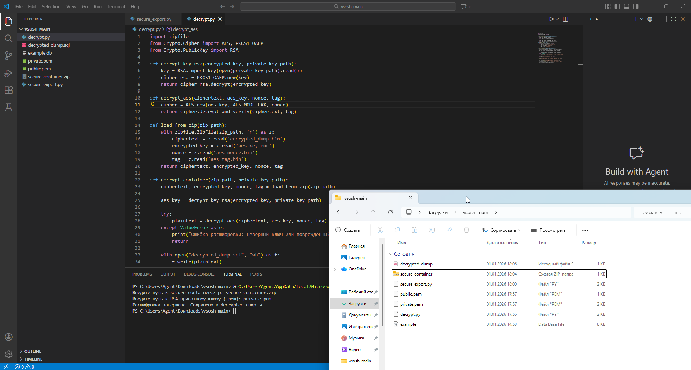

# 🛡️ SQuiL — Hybrid Encrypted Dump Protection

> 💡 **Защита экспорта баз данных от утечек через дампирование**

Этот проект реализует **гибридную систему шифрования** для предотвращения утечек при экспорте баз данных. Он защищает именно тот момент, когда злоумышленник пытается **выгрузить данные** через экспорт (`.dump`, `.sql`), даже если у него есть доступ к панели управления.

## 🚨 Актуальность

Массовые утечки баз данных в даркнет происходят не через взлом `.db`-файлов, а через штатный экспорт — **дампы (`.dump`, `.sql`)**. Проект решает эту проблему за счёт **подмены результата экспорта** на зашифрованный контейнер.

## 🔐 Как это работает

1. Пользователь или инсайдер инициирует экспорт базы данных.
2. Система вместо обычного `.dump`:
   - формирует дамп в оперативной памяти;
   - шифрует его с помощью AES-256;
   - шифрует AES-ключ с помощью RSA-2048.
3. На выходе — **нечитаемый контейнер**, расшифровать который можно только с приватным ключом.

📦 Даже если файл `.dump` утекает — содержимое надёжно защищено.

## 📂 Структура проекта

```bash
vsosh/
├── example.db           # тестовая база данных (SQLite)
├── secure_export.py     # шифрование дампа базы
├── decrypt.py           # расшифровка дампа
└── README.md            # инструкция
```

## 🧪 Пример работы

Исходная таблица:

| id | name  | email             |
|----|-------|-------------------|
| 1  | Alice | alice@example.com |
| 2  | Bob   | bob@example.com   |

После шифрования:

- `.bin` файлы содержат защищённые данные.
- Файл `.sql` восстанавливается **только при наличии приватного ключа**.

## 🛠️ Установка и запуск

### 📌 Зависимости

- Python 3.8+
- [PyCryptodome](https://pypi.org/project/pycryptodome/)
- [openssl для Windows](https://sourceforge.net/projects/openssl-for-windows/)

```bash
pip install pycryptodome
```

### 🔑 Генерация ключей

```bash
# Сгенерировать RSA-ключи (можно через OpenSSL)
openssl genrsa -out private.pem 2048
openssl rsa -in private.pem -out public.pem -pubout
```

### 🔒 Шифрование

```bash
python secure_export.py
```
→ Введите путь к базе данных и `public.pem`

### 🔓 Расшифровка

```bash
python decrypt.py
```
→ Укажите `private.pem` и пути к зашифрованным файлам

## 📚 Используемые технологии

- 📦 `sqlite3` — работа с базой данных
- 🔐 `Crypto.Cipher` (PyCryptodome) — AES‑256, RSA‑2048
- 🧾 `OpenSSL` — генерация ключей
- 💾 Форматы: `.db`, `.sql`, `.bin`, `.pem`

## 🚀 Возможности для развития

- Веб-интерфейс для экспорта
- Поддержка PostgreSQL, MySQL
- Генерация ключей в GUI
- Ведение журнала экспорта (audit log)

## 📜 Лицензия

MIT — используй свободно с упоминанием авторства.

## 🤝 Автор

**femom**  
Школьный проект по информационной безопасности, ВсОШ 2025  
Контакты / GitHub / Telegram: [Github](https://github.com/fem0m), [Telegram](https://t.me/femom)

## 🧪 Пример результата после шифрования

Вот как выглядит результат безопасного экспорта дампа:




> *take care*
